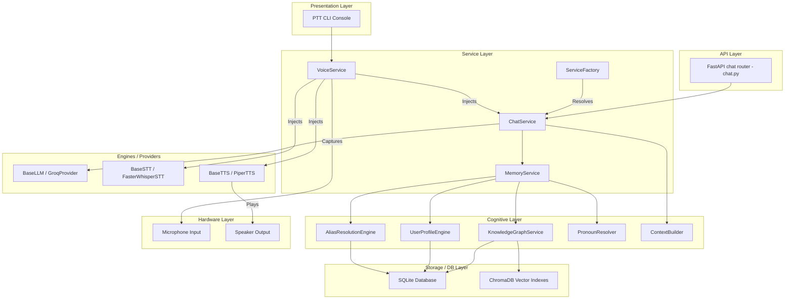

# Architecture Layers Diagram

* **Last Updated**: 2026-08-08
* **Current Phase**: Phase 5.3 (Planned / Next)
* **Status**: Freeze
* **Version**: v0.5.2

---

> [!NOTE]
> **Planned GUI Integration (Phase 10)**:
> A Desktop Graphical User Interface (HUD) is planned for Phase 10. It will connect to the API Layer (`REST`) but is not part of the active Phase 5.2 execution path.
