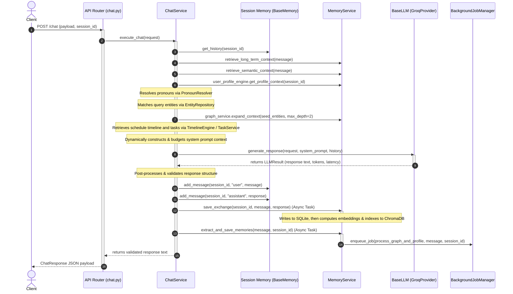

# Backend Execution Sequence Diagram

* **Last Updated**: 2026-08-08
* **Current Phase**: Phase 5.3 (User Preferences, Habits & Tasks)
* **Status**: Freeze
* **Version**: v0.5.3

---

```mermaid
sequenceDiagram
    autonumber
    actor Client
    participant Router as API Router (chat.py)
    participant CS as ChatService
    participant Mem as Session Memory (BaseMemory)
    participant MS as MemoryService
    participant LLM as BaseLLM (GroqProvider)
    participant Background as BackgroundJobManager

    Client->>Router: POST /chat (payload, session_id)
    activate Router
    Router->>CS: execute_chat(request)
    activate CS
    
    %% Context compilation
    CS->>Mem: get_history(session_id)
    CS->>MS: retrieve_long_term_context(message)
    CS->>MS: retrieve_semantic_context(message)
    CS->>MS: user_profile_engine.get_profile_context(session_id)
    Note over CS: Resolves pronouns via PronounResolver
    Note over CS: Matches query entities via EntityRepository
    CS->>MS: graph_service.expand_context(seed_entities, max_depth=2)
    Note over CS: Retrieves schedule timeline and tasks via TimelineEngine / TaskService
    
    Note over CS: Dynamically constructs & budgets system prompt context
    
    CS->>LLM: generate_response(request, system_prompt, history)
    activate LLM
    LLM-->>CS: returns LLMResult (response text, tokens, latency)
    deactivate LLM
    
    Note over CS: Post-processes & validates response structure
    
    CS->>Mem: add_message(session_id, "user", message)
    CS->>Mem: add_message(session_id, "assistant", response)
    
    %% Async background save pipeline
    CS->>MS: save_exchange(session_id, message, response) (Async Task)
    activate MS
    Note over MS: Writes to SQLite, then computes embeddings & indexes to ChromaDB
    deactivate MS
    
    CS->>MS: extract_and_save_memories(message, session_id) (Async Task)
    activate MS
    MS->>Background: enqueue_job(process_graph_and_profile, message, session_id)
    deactivate MS
    
    CS-->>Router: returns validated response text
    deactivate CS
    Router-->>Client: ChatResponse JSON payload
    deactivate Router
```
