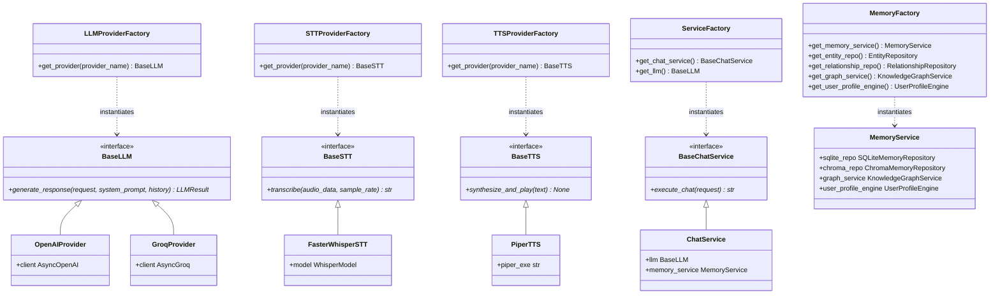

# Abstraction and Factories Interface Diagram

* **Last Updated**: 2026-08-07
* **Current Phase**: Phase 5.3
* **Status**: Current
* **Version**: v0.5.2

---

```mermaid
classDiagram
    %% Base Interfaces
    class BaseLLM {
        <<interface>>
        +generate_response(request, system_prompt, history)* LLMResult
    }
    class BaseSTT {
        <<interface>>
        +transcribe(audio_data, sample_rate)* str
    }
    class BaseTTS {
        <<interface>>
        +synthesize_and_play(text)* None
    }
    class BaseChatService {
        <<interface>>
        +execute_chat(request)* str
    }

    %% Factories
    class LLMProviderFactory {
        +get_provider(provider_name) BaseLLM
    }
    class STTProviderFactory {
        +get_provider(provider_name) BaseSTT
    }
    class TTSProviderFactory {
        +get_provider(provider_name) BaseTTS
    }
    class ServiceFactory {
        +get_chat_service() BaseChatService
        +get_llm() BaseLLM
    }
    class MemoryFactory {
        +get_memory_service() MemoryService
        +get_entity_repo() EntityRepository
        +get_relationship_repo() RelationshipRepository
        +get_graph_service() KnowledgeGraphService
        +get_user_profile_engine() UserProfileEngine
    }

    %% Implementations
    class OpenAIProvider {
        +client AsyncOpenAI
    }
    class GroqProvider {
        +client AsyncGroq
    }
    class FasterWhisperSTT {
        +model WhisperModel
    }
    class PiperTTS {
        +piper_exe str
    }
    class ChatService {
        +llm BaseLLM
        +memory_service MemoryService
    }
    class MemoryService {
        +sqlite_repo SQLiteMemoryRepository
        +chroma_repo ChromaMemoryRepository
        +graph_service KnowledgeGraphService
        +user_profile_engine UserProfileEngine
    }

    %% Inheritance relationships
    BaseLLM <|-- OpenAIProvider
    BaseLLM <|-- GroqProvider
    BaseSTT <|-- FasterWhisperSTT
    BaseTTS <|-- PiperTTS
    BaseChatService <|-- ChatService

    %% Resolution relationships
    LLMProviderFactory ..> BaseLLM : instantiates
    STTProviderFactory ..> BaseSTT : instantiates
    TTSProviderFactory ..> BaseTTS : instantiates
    ServiceFactory ..> BaseChatService : instantiates
    MemoryFactory ..> MemoryService : instantiates
```

